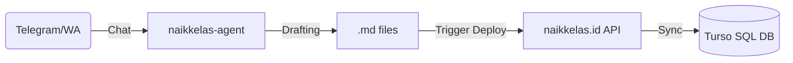

# Rencana Integrasi API: Agent Deployment ke Platform Naik Kelas

Dokumen ini mendefinisikan arsitektur komunikasi antara **naikkelas-agent** (repositori ini) dengan **naikkelas.id** (aplikasi SvelteKit/Turso). Tujuannya adalah otomatisasi deploy kurikulum langsung dari draf Markdown.

---

## 🏗️ ARSITEKTUR KOMUNIKASI
Agen AI akan bertindak sebagai klien yang mengirimkan data terstruktur melalui API endpoint privat di platform Naik Kelas.

---

## 📡 DRAFT API ENDPOINT (REST)

### 1. `POST /api/v1/deployment/course`
Digunakan untuk membuat atau memperbarui kursus utuh beserta modul, pelajaran, dan material.
- **Payload**: JSON (Hasil ekstraksi Markdown).
- **Authentication**: Bearer Token (Organization API Key).

### 2. `POST /api/v1/deployment/module`
Untuk melakukan update parsial pada modul tertentu.

---

## 📊 MAPPING DATA (MARKDOWN -> DATABASE)

| Markdown Element | Target DB Table | Notes |
| :--- | :--- | :--- |
| \# Judul Kursus | `courses.name` | Auto-slug generation. |
| \## Modul | `modules.title` | Urutan berdasarkan prefix 10, 20, 30. |
| \### Pelajaran | `lessons.title` | Isi dokumen menjadi `lessons.content`. |
| \- [ ] Task/KC | `materials.task` | Dikonversi menjadi tipe material 'Assignment'. |

---

## 🚀 ROADMAP IMPLEMENTASI API
1.  **Phase 1: Serializer**: Membangun modul di agen yang mampu mengubah file `.md` menjadi JSON yang valid sesuai skema Drizzle di `naikkelas.id`.
2.  **Phase 2: Endpoint Development**: Membangun handler di rute `/api/deploy` di dalam repo utama `naikkelas.id`.
3.  **Phase 3: Secure Handshake**: Implementasi verifikasi tanda tangan (signature) untuk memastikan hanya agen resmi yang bisa melakukan deploy.
4.  **Phase 4: Feedback Loop**: Agen dapat report status deployment kembali ke operator (Telegram/WhatsApp).

---
**Status**: Dokumentasi Perancangan  
**Arsitek**: sandikodev (Lead Engineering)  
**Last Update**: 2026-03-30
